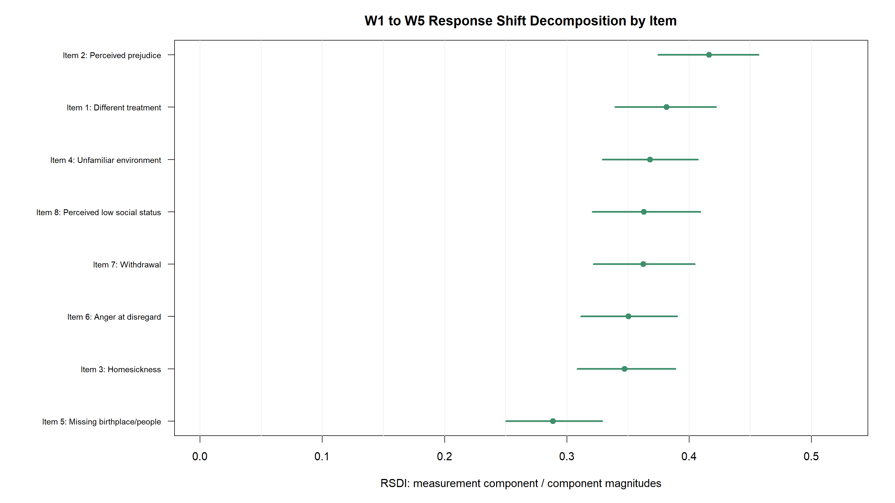
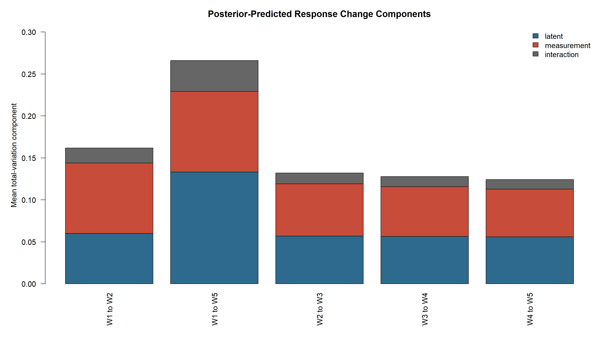
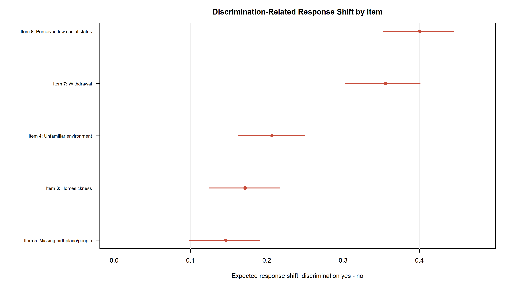

# 잠재변화인가 측정기능 변화인가?
## MAPS 2기 부모 패널 문화적응 스트레스의 종단 순서형 MNLFA와 RSDI 예비 적용

**영문 제목:** *Distinguishing Latent Change from Measurement-Function Change in Longitudinal Acculturative Stress: A Preliminary Bayesian Ordinal MNLFA and RSDI Application to the MAPS 2 Parent Panel*

**저자:** 이창현
**저자·소속·윤리정보:** 학술지 투고 양식에서 최종 확정
**문서 상태:** 예비 실증 개념증명 및 확증 재분석 전환본

---

## 국문초록

종단 연구에서 관찰점수의 변화가 잠재구성개념의 변화로 해석되려면 반복 문항이 시간과 개인 특성에 걸쳐 비교 가능한 방식으로 작동해야 한다. 그러나 이주배경 부모의 문화적응 스트레스 문항은 한국어 능력, 소득, 연령, 차별경험의 변화에 따라 역치 또는 변별도가 달라질 수 있으며, 이 경우 관찰된 응답 변화에는 잠재 스트레스 변화와 측정기능 변화가 함께 포함된다. 본 연구는 MAPS 2 부모 1–5차 자료에 종단 순서형 MNLFA를 예비 적용하고, 범주확률 공간에서 잠재성분·측정성분·상호작용성분을 분해하는 RSDI의 운용 가능성을 탐색하였다. 분석자료는 2,191명, 9,662개 개인-시점, 77,296개 문항응답이며, 완전사례 필터 후 주모형에는 2,190명과 77,160개 응답이 포함되었다. 네 VI 시드에서 세 모형은 감소 방향을 보였으나 척도와 식별조건이 달라 절대크기는 비교하지 않았다. 차별 관련 threshold-DIF는 네 시드에서 같은 방향이었지만, 일부 기준 loading은 legacy hard-clamp 하한에 포화되었고 동일 structural-state NUTS는 완료되지 않았다. RSDI는 seed 20260702의 단일 VI 실행에서 .360, 문항 1·2·6 제외 한 번의 민감도 실행에서 .260으로 산출되었다. 두 값은 seed·앵커·경로·집계·잔차조건에 의존하는 탐색적 기술량이며 확증적 효과크기가 아니다. 단일요인 오지정, 차별 문항과 moderator의 의미중첩, 회상창 불일치, 가구 ID 기반 추적, 패널 이탈과 가중치 미적용을 해결하려면 앵커식별·다요인·동일모형 NUTS/PPC·W2–W5 민감도·IPW/공식 가중치·recovery simulation이 필요하다.

**주제어:** MAPS 2, 다문화청소년 패널조사 2기, 문화적응 스트레스, 종단 측정불변성, 순서형 MNLFA, 차별경험, differential item functioning, response shift, RSDI

## Abstract

We used Waves 1–5 of the MAPS 2 parent file to conduct a preliminary Bayesian ordinal MNLFA and a model-implied RSDI calculation. The derived file contained 2,191 household-linked parent records, 9,662 person-waves, and 77,296 item responses; complete-case filtering yielded 2,190 linked records and 77,160 responses. Four mean-field VI runs showed a common negative direction for discrimination-related parallel-threshold moderation, but baseline loadings reached the legacy hard-clamp boundary in some runs and the matched structural-state NUTS was not completed. The RSDI was .360 in one seed-20260702 full-data VI run and .260 in one item-exclusion sensitivity run. These are conditional exploratory summaries, not seed-averaged posterior estimates or validated proportions of change. The current analysis also leaves unresolved the single-factor versus multidimensional measurement structure, semantic overlap between discrimination and item content, non-equivalent recall windows, household-level rather than parent-level identifiers, panel attrition, survey weights, and the absence of posterior predictive validation. An anchor-identified, no-hard-clamp model with smooth bounded moderation, matched-model NUTS/PPC, W2–W5 and weighted/IPW sensitivities, and recovery simulation is required before substantive RSDI claims are treated as confirmatory.

**Keywords:** acculturative stress, longitudinal measurement invariance, moderated nonlinear factor analysis, ordinal data, differential item functioning, response shift, MAPS 2

---

# 1. 서론

## 1.1 종단 변화의 해석 문제

종단 패널연구는 시간에 따른 평균 궤적과 개인차를 추정하여 발달, 적응, 위험의 변화를 설명한다. 그러나 동일한 문항을 반복해서 사용했다는 사실만으로 서로 다른 시점의 점수가 자동으로 비교 가능해지는 것은 아니다. 잠재평균이나 성장기울기의 해석은 문항이 동일한 잠재구성개념을 동일한 방식으로 측정한다는 전제에 의존한다. 적재량이나 역치가 시점 또는 응답자 특성에 따라 변하면 관찰점수의 차이는 잠재수준 변화뿐 아니라 문항기능 변화도 반영할 수 있다. 이 때문에 측정불변성은 종단 구조모형에서 부수적인 사전검사가 아니라 변화량 자체의 의미를 규정하는 조건이다(Liu et al., 2017; Meredith, 1993; Widaman et al., 2010).

이 문제는 순서형 문항에서 특히 중요하다. 리커트형 범주 사이의 간격을 동일하다고 가정할 수 없으므로, 평균점수의 선형 변화는 범주선택 확률을 생성하는 잠재 반응과 역치의 변화를 구분하지 못한다. 순서형 확인적 요인모형은 연속지표 모형과 다른 식별조건을 필요로 하며, 역치 제약의 선택에 따라 불변성 수준의 의미도 달라진다(Liu et al., 2017; Wu & Estabrook, 2016). 비불변 문항을 불변으로 처리하면 잠재평균과 성장모수의 추정이 달라질 수 있고, 집단 또는 시점 차이가 구성개념 변화인지 측정기능 차이인지 구별하기 어려워진다(Kim & Willson, 2014).

전통적인 종단 측정불변성 검정은 대개 시점을 몇 개의 이산 집단처럼 취급하고 일련의 제약모형을 비교한다. 이 접근은 명확하고 유용하지만, 문항기능이 연령, 언어능력, 소득, 차별경험처럼 연속적이거나 시간에 따라 변하는 여러 특성의 함수일 때 제약 수가 빠르게 증가한다. 또한 부분불변성 모형에서 어느 문항을 해제할지에 따라 결과가 달라질 수 있다. Moderated nonlinear factor analysis(MNLFA)는 잠재평균·분산과 문항모수를 공변량의 함수로 표현함으로써 연속형과 범주형 배경변수에 따른 differential item functioning(DIF)을 하나의 모형 안에서 다룬다(Bauer, 2017; Curran et al., 2014). 다중 배경변수를 다루는 정규화 또는 베이지안 패널티 접근은 대규모 DIF 탐색의 계산과 과적합 문제를 완화할 수 있다(Bauer et al., 2020; Brandt et al., 2025).

최근의 종단 MNLFA 연구는 측정모수 변화를 잠재성장 과정과 결합함으로써, 측정불변성 위반을 무시한 1차 성장모형이 구성개념 변화의 해석을 왜곡할 수 있음을 보여주었다(Chen & Bauer, 2024, 2026). 이 발전은 ‘DIF가 있는가’라는 검정 문제를 넘어 ‘DIF를 고려했을 때 성장에 관한 결론이 어떻게 달라지는가’라는 해석 문제로 초점을 이동시킨다. 그럼에도 개별 적재량·역치 계수의 목록만으로는 측정기능 변화가 관찰 응답분포의 종단 변화에서 어느 정도의 실질적 크기를 갖는지 직관적으로 파악하기 어렵다. IRT의 DIF 효과크기 연구는 문항모수 차이를 응답확률 또는 기대점수 차이로 번역해야 함을 강조했지만(Steinberg & Thissen, 2006), 검토한 문헌 범위에서는 잠재경로와 측정경로의 종단 범주확률 변화를 함께 분해하는 직접 대응 지표를 확인하지 못했다.

## 1.2 문화적응 스트레스와 차별경험

문화적응은 새로운 사회·문화 환경과 지속적으로 접촉하면서 개인의 행동과 심리 과정이 조정되는 복합적 과정이다(Berry, 1997). 이 과정에서 언어 사용, 경제적 자원, 사회적 지위, 차별경험은 스트레스의 수준뿐 아니라 스트레스 문항을 이해하고 응답하는 기준에도 관련될 수 있다. 예를 들어 차별을 경험한 부모가 동일한 잠재 스트레스 수준에서도 ‘다르게 대우받는다’ 또는 ‘사회적 지위가 낮다’는 문항의 높은 범주를 선택할 가능성이 커질 수 있다. 지각된 차별이 건강과 심리적 부담에 폭넓게 관련된다는 근거는 충분하지만(Pascoe & Smart Richman, 2009), 이 연관성만으로 차별이 문항의 response shift를 인과적으로 발생시켰다고 결론 내릴 수는 없다.

Response shift는 건강관련 삶의 질 연구에서 개인의 내적 기준, 가치의 우선순위, 구성개념 정의가 변하여 같은 잠재상태가 다른 응답으로 표현되는 현상을 설명하기 위해 발전하였다(Sprangers & Schwartz, 1999). 구조방정식 접근은 진정한 변화와 측정편향 또는 response shift를 분리하려고 시도해 왔다(King-Kallimanis et al., 2010; Oort, 2005). 본 연구에서 이 용어는 고전적 의미의 재개념화나 인과적 심리과정을 직접 입증한다는 뜻으로 사용하지 않는다. 보다 좁게, 시간가변 공변량과 관련된 종단 측정기능 변화가 관찰되는 경우를 ‘response-shift-consistent’ 패턴으로 부른다.

MAPS 2 부모 패널의 문화적응 스트레스 척도는 차별대우, 편견, 향수, 낯선 환경, 무시, 위축, 낮은 사회적 지위 등 서로 다른 내용을 포함한다(한국청소년정책연구원, 2024, 「이용자를 위하여」 항목 5). 문항내용은 잠정적으로 차별·사회적 대우(1, 2, 6, 7, 8)와 향수·분리·낯선 환경(3, 4, 5)의 두 내용군으로도 읽힐 수 있다. 현재 단일요인 모형은 이 대안 구조와 국소의존성을 검증하지 않았으므로, 차별 관련 DIF가 response-shift-consistent 측정기능 변화인지 누락된 하위요인의 직접 연관인지 아직 구분하지 못한다. 이 구성은 문화적응 스트레스의 다면성을 포착한다는 장점이 있지만, 차별경험 공변량과 일부 문항 내용의 의미적 중첩을 초래할 수 있다. 따라서 차별경험 관련 DIF가 나타나더라도 그것이 일반적인 응답기준 변화인지, 차별에 가까운 문항내용의 직접적 중첩인지, 또는 잠재상태와 측정경로를 분리하는 모형 식별의 산물인지 구분해야 한다.

## 1.3 RSDI의 운용적 정의와 연구 공백

본 연구는 종단 순서형 MNLFA가 함의하는 범주확률을 이용하여 Response-Shift Decomposition Index(RSDI)를 계산한다. RSDI의 핵심은 두 시점 사이에서 잠재상태만 바꾼 반사실적 확률벡터, 측정공변량만 바꾼 확률벡터, 둘을 함께 바꾼 확률벡터를 구성하는 데 있다. 이를 통해 전체 확률변화를 잠재성분, 측정성분, 두 변화의 비가법적 상호작용성분으로 나눈다. 순서형 응답의 범주 간 간격을 가정하지 않기 위해 각 성분의 크기는 범주확률 벡터 사이의 총변동거리(total variation distance)로 요약한다.

RSDI는 설명분산, 인과적 매개비율, 또는 관찰된 총변화의 가법적 백분율이 아니다. 성분벡터에 각각 절댓값 노름을 적용하므로 잠재성분과 측정성분이 서로 상쇄되는 경우에도 두 성분의 크기는 모두 클 수 있다. 따라서 RSDI는 선택한 모형, 식별, 공변량 경로와 시점쌍에 조건부인 ‘성분크기 지표’이다. 특히 본 연구의 주 RSDI는 연령, 한국어 능력, 소득, 차별경험의 측정경로를 함께 교체한 `RSDI_all-Z`이며, 차별경험 하나의 기여율이 아니다. 차별경험을 0에서 1로 바꾸는 고정-잠재 대비는 별도의 측정경로 대비로 보고한다.

## 1.4 연구목적과 연구질문

본 연구의 목적은 MAPS 2 부모 패널의 문화적응 스트레스에 종단 순서형 MNLFA와 RSDI를 예비 적용하여, 잠재변화와 측정기능 변화의 구분이 실제 종단 해석에 어떤 정보를 더하는지 검토하는 것이다. 구체적인 연구질문은 다음과 같다.

1. 관찰점수 혼합모형, 측정불변 순서형 잠재성장모형, structural-state 종단 MNLFA는 문화적응 스트레스의 평균 변화 방향에 관해 어떤 결론을 제시하는가?
2. 차별경험과 관련된 문항 역치 및 적재량 DIF는 반복된 변분추론 초기값에서 어느 정도 방향 안정성을 보이는가?
3. 1차에서 5차까지 모든 측정공변량을 함께 교체한 `RSDI_all-Z`에서 잠재성분, 측정성분, 상호작용성분의 상대적 크기는 어떠한가?
4. 차별경험과 의미적으로 가까운 문항 1, 2, 6을 제외해도 차별경험 관련 측정기능 변화와 RSDI 패턴이 남는가?
5. 이전 measurement-only 모형의 부분표본 NUTS 결과는 현 structural-state 분석의 어떤 측정패턴과 방향이 일치하며, 어디에서 일치하지 않는가?

이 질문들은 인과효과 검정이 아니라 모형이 함의하는 측정기능 변화와 해석 민감도의 기술을 목표로 한다.

---

# 2. 방법

## 2.1 자료와 연구대상

본 연구는 한국청소년정책연구원이 수행한 「다문화청소년 패널조사 2기(MAPS 2)」 부모 자료의 1–5차 조사(2019–2023년)를 활용하였다. MAPS 2는 다문화청소년과 부모를 추적하는 종단조사이며, 자료의 저작권과 지적재산권은 한국청소년정책연구원에 있다. 분석용 장기자료는 문화적응 스트레스 문항에 응답한 부모-시점을 단위로 구성되었다.

파생 장기자료에는 2,191명의 부모, 9,662개 개인-시점, 77,296개 문항응답이 포함되었다. 개인-시점마다 8개 문항이 있었다. 문항응답, 부모연령, 한국어 능력, 차별경험에는 분석행 수준의 결측이 없었고, 로그소득은 136개 문항행에서 결측이었다. 주 MNLFA는 DIF 및 잠재상태 예측변수가 모두 관찰된 문항행만 남기는 행 단위 완전사례 방식을 사용하였다. 이 필터 후 2,190명, 77,160개 문항응답, 5개 시점이 남았다. 이는 모든 참여자가 다섯 시점에 완전하게 참여한 균형패널 분석을 뜻하지 않는다. 1차와 5차가 모두 관찰된 RSDI 분석에는 1,743명이 포함되었고, 다섯 시점을 모두 가진 참여자는 1,702명이었다.

표 1은 필터 이전 파생자료의 시점별 기술통계이다. 관찰된 부모 수는 1차 2,186명에서 5차 1,750명으로 감소하였다. 따라서 시간에 따른 평균 변화에는 개인내 변화뿐 아니라 패널 이탈과 시점별 표본구성 변화가 섞일 수 있다. 주 분석은 조사 가중치, 중도탈락 역확률가중치, 다중대치를 적용하지 않았다. 원자료의 부모 파일 ID는 가구 ID이며 부모 개인 PID가 없어 파동 간 동일 응답자를 직접 확인할 수 없다. 현재 분석은 어머니 응답자 proxy가 안정적이라는 간접 점검에 의존하며, 모집단 부모 전체가 아니라 관찰 가능한 가구-파동 분석표본의 조건부 기술로 해석한다. 또한 차별경험 문항의 회상창이 1차와 후속 파동에서 동일하지 않을 가능성이 있어, 파동 간 차별경험 변화는 심리적 변화와 문항기간 변화를 함께 포함할 수 있다.

**표 1**  
*파동별 분석자료 규모와 문화적응 스트레스 관찰평균*

| 파동 | 관찰 부모 수 | 문항응답 수 | 로그소득 완전 부모 수 | 8문항 평균 범주 | 평균의 표준오차 |
|---:|---:|---:|---:|---:|---:|
| 1차 | 2,186 | 17,488 | 2,183 | 2.630 | 0.016 |
| 2차 | 1,995 | 15,960 | 1,992 | 2.594 | 0.016 |
| 3차 | 1,920 | 15,360 | 1,914 | 2.565 | 0.016 |
| 4차 | 1,811 | 14,488 | 1,808 | 2.540 | 0.017 |
| 5차 | 1,750 | 14,000 | 1,748 | 2.437 | 0.017 |

*주.* 관찰평균은 1–5 순서범주의 산술평균으로 기술적 비교만을 위한 값이다. 부모 수와 문항응답 수는 로그소득 완전사례 필터 이전 값이다.

1차 참여자의 평균연령은 37.51세(SD = 5.60, 범위 24–59)였고, 1–5 범위의 한국어 능력 평균은 3.55(SD = 0.80)였다. 이 값은 원표본 전체의 모집단 추정치가 아니라 파생 분석자료의 기술통계이다.

## 2.2 측정변수

### 문화적응 스트레스

문화적응 스트레스는 5개 순서범주로 응답한 8문항으로 측정하였다. 문항은 (1) 사회생활에서 한국 사람들과 다른 대우를 받음, (2) 외국에서 왔다는 편견, (3) 고향에 대한 그리움, (4) 고향을 떠나 낯선 환경에서 생활하는 슬픔, (5) 태어난 곳과 사람들에 대한 그리움, (6) 외국출신자를 무시하는 것에 대한 분노, (7) 외국에서 왔다는 이유로 위축됨, (8) 외국에서 왔기 때문에 사회적 지위가 낮다고 느낌을 다룬다. MAPS 2 유저가이드는 Sandhu와 Asrabadi (1994)의 원척도를 국내에서 번안·수정한 이승종(1995)과 이소래(1997)의 척도 계보를 다시 수정하여 8문항을 구성했다고 설명한다(한국청소년정책연구원, 2024, pp. 58–59).

순서형 측정모형은 Samejima (1969)의 graded-response 관점과 같은 누적확률 구조를 사용하되, Stan의 ordered-logistic parameterization으로 구현하였다. 높은 범주는 더 높은 문화적응 스트레스를 나타내도록 코딩하였다.

### DIF 공변량

DIF 공변량 벡터 `x^D_it`에는 부모연령, 한국어 능력, 로그소득, 차별경험을 포함하였다. 부모연령은 각 파동 안에서 평균중심화하였다. 한국어 능력은 네 문항 평균을 계산한 뒤 전체 장기자료에서 표준화하였고, 가구소득은 1보다 작은 값을 1로 제한한 뒤 자연로그를 취하고 전체 자료에서 표준화하였다. 차별경험은 해당 시점에 경험이 있으면 1, 없으면 0으로 코딩하였다. 파생자료의 9,662개 개인-시점 중 1,308개(13.5%)에서 차별경험이 1이었다.

### 잠재상태 공변량

잠재상태 공변량 벡터 `x^S_it`에는 파동 내 중심화 연령의 개인평균, 한국어 능력·로그소득·차별경험의 개인간 평균, 그리고 이 세 변수의 개인내 편차를 포함하였다. 이 분해는 사람 간 차이와 같은 사람의 시간에 따른 변동을 구분하기 위한 것이다. 다만 연령은 개인간 성분만 포함하였고, 측정경로에서는 원래의 파동중심화 값을 사용하였다.

## 2.3 비교모형

첫 번째 비교모형은 개인-시점 8문항 평균 범주를 종속변수로 한 REML 선형혼합모형이었다. 중심화 시간을 고정효과로 넣고 개인별 무선절편과 무선시간기울기를 허용하였다. 이 모형은 순서범주를 등간척도처럼 평균하므로 주 추론모형이 아니라 관찰 추세를 보여주는 기술적 비교 기준이다.

두 번째 비교모형은 문항 적재량과 역치를 시점 및 공변량에 걸쳐 동일하게 둔 측정불변 순서형 잠재성장모형이었다. 주 MNLFA와 유사하게 개인별 잠재 절편·기울기와 개인-시점 occasion residual을 포함했지만 DIF는 허용하지 않았다. 순서형 불변모형은 측정동등성을 가정했을 때의 잠재 감소 방향을 보여주는 기준선이다(Widaman et al., 2010; Wu & Estabrook, 2016).

현재 비교모형 스크립트는 주 MNLFA와 동일한 공변량 완전사례 필터를 적용하지 않았다. 따라서 두 비교모형과 MNLFA는 엄밀한 동일표본 모형비교가 아니라 기술적 benchmark이다. 관찰범주 기울기와 잠재척도 기울기의 단위도 다르고, 두 잠재모형의 식별과 사전분포도 동일하지 않다. 이에 따라 모형 간 기울기의 절대크기나 차이를 검정하지 않고 방향만 비교하였다.

## 2.4 Structural-state 종단 순서형 MNLFA

개인 `i`, 시점 `t`, 문항 `j`의 순서형 반응 `Y_itj`는 다음과 같이 모형화하였다.

\[
Y_{itj}\sim \operatorname{OrderedLogistic}
\left(\lambda_{itj}\eta_{it},\boldsymbol{\kappa}_{itj}\right).
\]

문항의 유효 적재량은 공변량에 의해 조절되는 log-loading을 지수변환하여 양수로 제한하였다.

\[
\log \lambda_{itj}=\operatorname{clamp}\left(
\ell_{j0}+\mathbf{x}^{D\prime}_{it}\boldsymbol{\gamma}^{\lambda}_{j},
-1.5,1.5\right).
\]

문항 역치는 기준 역치벡터에 공변량별 평행 이동을 더했다.

\[
\boldsymbol{\kappa}_{itj}=\boldsymbol{\kappa}_{j0}+
\operatorname{clamp}\left(
\mathbf{x}^{D\prime}_{it}\boldsymbol{\gamma}^{\kappa}_{j},-3,3\right).
\]

현재 구현에서 한 공변량의 threshold-DIF 계수는 해당 문항의 모든 역치를 동일한 양만큼 이동시킨다. 따라서 범주별 비평행 역치 DIF는 표현하지 않는다. 역치 순서는 첫 역치와 양의 간격을 누적하여 보장하였다. 음의 threshold-DIF 계수는 다른 값이 같을 때 역치를 낮추므로 높은 응답범주를 선택할 확률이 커지는 방향을 뜻한다.

잠재상태는 개인별 성장요인, 구조상태 공변량, 개인-시점 공통 잔차로 구성하였다.

\[
\eta_{it}=b_{0i}+b_{1i}t_{it}+
\mathbf{x}^{S\prime}_{it}\boldsymbol{\beta}+\sigma_o u_{it}.
\]

개인별 절편과 기울기는 이변량 정규분포를 따르며, 절편 평균은 0, 기울기 평균은 `μ₁`로 두었다. 두 성장요인의 표준편차와 상관을 추정하였다. `u_it`는 같은 개인-시점의 모든 문항에 공유되는 표준정규 occasion residual이다. 주모형은 같은 네 공변량이 잠재상태와 문항기능 모두에 관련될 수 있도록 허용함으로써, 차별경험의 모든 연관을 DIF로 강제하는 단순 measurement-only 모형의 한계를 완화하려고 하였다.

### 사전분포

기준 log-loading에는 `N(0, 0.35²)`, loading DIF에는 `N(0, 0.20²)`, 평행 threshold DIF와 잠재상태 효과에는 각각 `N(0, 0.35²)` 사전분포를 사용하였다. 첫 역치는 `N(-1.5, 0.75²)`, log 역치간격은 `N(0, 0.35²)`, 평균기울기는 `N(0, 0.50²)`로 설정하였다. 성장요인 표준편차는 `half-N(0, 0.75²)`, 절편-기울기 상관행렬은 LKJ(2), occasion 표준편차는 `half-N(0, 0.50²)`를 따랐다. 이 정규화 사전분포는 많은 DIF 계수의 극단적 값을 제한하지만, 명시적인 변수선택 prior나 베이지안 패널티 선택규칙은 아니다. Prior predictive check와 대안 prior 척도 민감도 분석은 현재 산출물에 포함되지 않았다.

### 현재 모형의 식별 한계

현재 모형은 적재량을 양수로 제한하여 잠재요인의 부호를 정하고 절편 평균을 0으로 두었지만, 기준문항의 적재량을 1로 고정하거나 기준시점의 잠재분산을 1로 고정하지 않았다. 더 중요한 점은 모든 문항에서 동일 공변량의 적재량 및 역치 DIF를 허용하면서 그 공변량을 잠재상태 예측변수에도 포함했다는 것이다. 단순한 경우 응답자료가 직접 식별하는 것은 잠재상태 효과와 공통 threshold DIF 각각이 아니라 두 효과의 결합일 수 있다. 외부 앵커가 없으면 모든 문항에 공통으로 나타나는 이동을 잠재상태와 문항기능에 어떻게 배분할지가 사전분포와 parameterization에 의존한다.

따라서 이 연구의 현 추정치는 likelihood 수준에서 앵커 식별이 완성된 확증모형이 아니라 prior와 hard clamp가 정규화한 탐색적 해이다. 특히 ‘여덟 문항 모두 같은 방향의 threshold DIF’는 강한 보편적 DIF의 증거일 수도 있지만, 공통 잠재효과가 DIF 쪽으로 배분된 결과일 가능성도 배제할 수 없다. 최종 확증분석에서는 내용상 차별과 거리가 있는 복수 문항을 사전 앵커로 지정하고, 기준시점 잠재평균 0·분산 1을 고정한 뒤 대체 앵커와 effects coding 민감도를 비교해야 한다. legacy 실행의 기준 log-loading은 일부 시드에서 하드클램프 하한에 포화되어, 성장분산과 occasion 분산의 분해도 안정적이지 않았다. 이에 따라 본 개정판은 수치를 확증 결과로 승격하지 않고, 별도 maps_mnlfa_structural_state_anchored.stan에 marker/복수 앵커, smooth bounded moderation, log-likelihood, posterior predictive replicate를 구현하여 후속 calibration NUTS의 대상으로 분리한다.

## 2.5 RSDI의 계산

각 변분분포 표본 `s`, 개인 `i`, 문항 `j`, 두 시점 `t₀, t₁`에 대해 MNLFA가 함의하는 네 개의 범주확률 벡터를 계산하였다.

\[
\mathbf{p}_{00}=m_j(\eta_{it_0},\mathbf{Z}_{it_0}),\quad
\mathbf{p}_{10}=m_j(\eta_{it_1},\mathbf{Z}_{it_0}),
\]

\[
\mathbf{p}_{01}=m_j(\eta_{it_0},\mathbf{Z}_{it_1}),\quad
\mathbf{p}_{11}=m_j(\eta_{it_1},\mathbf{Z}_{it_1}).
\]

여기서 `m_j`는 잠재상태와 측정공변량을 5개 응답범주의 조건부 확률로 변환하는 문항반응함수이다. 네 벡터를 사용해 잠재성분 `L`, 측정성분 `M`, 상호작용성분 `I`를 다음과 같이 정의하였다.

\[
\mathbf{L}=\mathbf{p}_{10}-\mathbf{p}_{00},\qquad
\mathbf{M}=\mathbf{p}_{01}-\mathbf{p}_{00},
\]

\[
\mathbf{I}=\mathbf{p}_{11}-\mathbf{p}_{10}-\mathbf{p}_{01}+\mathbf{p}_{00}.
\]

따라서 전체 확률변화는 `p₁₁ - p₀₀ = L + M + I`이다. 순서범주에 등간격을 가정하지 않기 위해 성분벡터의 크기를 총변동 노름으로 계산하였다.

\[
\lVert\mathbf{D}\rVert_{TV}=\frac{1}{2}\sum_{k=1}^{5}|D_k|.
\]

현 구현의 문항별 RSDI는 각 성분의 개인별 총변동거리를 시점쌍의 공통 참여자에 대해 동일가중 평균한 뒤 비율을 계산한다.

\[
RSDI^{(s)}_j=
\frac{\overline{\lVert\mathbf{M}^{(s)}_{ij}\rVert}_{TV}}
{\overline{\lVert\mathbf{L}^{(s)}_{ij}\rVert}_{TV}+
\overline{\lVert\mathbf{M}^{(s)}_{ij}\rVert}_{TV}+
\overline{\lVert\mathbf{I}^{(s)}_{ij}\rVert}_{TV}}.
\]

분모가 `10⁻⁸` 이하인 경우 비율을 계산하지 않았다. 전체 `RSDI_all-Z`는 seed 20260702의 한 변분분포에서 산출한 8개 문항별 ratio의 산술평균이며, 네 시드의 optimizer 불확실성을 포함하지 않는다. 이는 문항별 분자와 분모를 모두 합친 pooled-scale 비율도 아니다. `Z`의 교체는 연령, 한국어 능력, 소득, 차별경험의 관찰된 측정경로 변화를 함께 포함한다.

본 분해는 잠재상태를 먼저 바꾸고 측정공변량을 바꾸는 한 경로에 기초한다. 변화 순서를 뒤집는 분해와 Shapley 대칭분해는 아직 구현하지 않았다. 또한 현재 RSDI의 잠재상태에는 occasion residual이 포함된 conditional-realized state가 사용되며, 시점쌍에서 모두 관찰된 사람의 교집합을 동일가중으로 사용한다. 중도탈락·조사설계 가중치, u_it=0 structural-trajectory estimand, residual을 적분한 marginal-population estimand는 아직 구현하지 않았다.

## 2.6 차별경험 고정-잠재 측정경로 대비

RSDI와 별도로 각 시점에서 posterior latent state와 다른 측정공변량을 고정하고, DIF 설계행렬의 차별경험 값만 0과 1로 바꾸어 범주확률과 기대응답의 차이를 계산하였다. 이 연산에서 잠재상태 모형에 포함된 개인간·개인내 차별경험 성분은 관찰값으로 유지된다. 따라서 이 대비는 ‘같은 모형화된 잠재상태에서 측정경로의 차별경험 열만 달라질 때 나타나는 응답차이’이며, 차별경험의 총효과, 자연직접효과, 매개효과 또는 인과효과가 아니다.

## 2.7 추정, 안정성 점검 및 민감도 분석

Structural-state MNLFA는 Stan으로 구현하고 full-data mean-field variational inference(VI)로 추정하였다. 각 실행은 최대 15,000회의 최적화 반복, ELBO 표본 50개, 약 1,000개의 변분분포 출력표본을 사용하였다. 초기값 의존성을 점검하기 위해 20260702, 20260703, 20260704, 20260705의 네 시드로 반복하였다. VI는 복잡한 베이지안 모형의 계산을 가능하게 하지만 근사분포가 다봉성이나 모수 간 의존을 충분히 표현하지 못하고 불확실성을 과소추정할 수 있다(Blei et al., 2017). 따라서 본문의 5–95백분위수는 ‘90% 근사 변분구간’으로 부르며 정확한 NUTS posterior 신용구간과 구분하였다. 네 시드의 최솟값–최댓값도 posterior interval이 아니라 최적화 실행 간 점추정치 범위이다.

현 structural-state 전체자료 모형의 NUTS 추정은 완료되지 않았다. 기존 부분표본 NUTS 결과는 이전 measurement-only MNLFA에서 산출되었으므로, 큰 threshold-DIF 효과의 방향을 제한적으로 비교하는 데만 사용하였다. NUTS의 수렴과 표본품질을 평가할 때는 개선된 R-hat과 bulk/tail effective sample size를 Vehtari et al. (2021)에 따라 확인해야 한다. 그러나 과거 부분표본 실행의 완전한 메타데이터가 보존되지 않아, 이를 현 structural-state 모형의 보정 또는 확증 자료로 간주하지 않았다.

문항내용과 차별경험의 의미적 중첩을 점검하기 위해 문항 1(차별대우), 2(편견), 6(외국출신자 무시에 대한 분노)을 제외하고 동일한 structural-state 모형을 한 번의 full-data mean-field VI로 재추정하였다. 이 민감도 모형에는 2,190명, 5개 시점, 5문항, 48,225개 문항응답이 포함되었다. 문항제외 분석은 의미중첩에 대한 한 가지 점검일 뿐, 대안 앵커·prior·결측처리·추정방법을 포괄하는 강건성 검증은 아니다.

---

# 3. 결과

## 3.1 관찰 추세와 비교모형

8문항의 관찰평균은 1차 2.630에서 2차 2.594, 3차 2.565, 4차 2.540, 5차 2.437로 낮아졌다. 관찰점수 선형혼합모형에서 중심화 시간의 고정효과는 -0.0419(SE = 0.0043)로 추정되었다. 이 값은 한 파동이 증가할 때 1–5 평균범주가 약 0.042만큼 감소하는 기술적 선형 추세를 뜻한다.

측정불변 순서형 잠재성장모형의 평균기울기는 -0.222였고, mean-field 변분분포의 5–95백분위수는 [-0.239, -0.205]였다. Structural-state MNLFA의 평균기울기는 네 시드에서 모두 음수였으며, 시드 평균은 -0.210, 시드 간 SD는 0.050, 점추정치 범위는 [-0.260, -0.164]였다. 마지막 범위는 posterior 구간이 아니다. 세 모형은 모두 평균 감소 방향을 보였지만, 관찰범주와 잠재척도의 단위가 다르고 두 잠재모형도 같은 식별척도에 놓여 있지 않으므로 -0.042, -0.222, -0.210의 크기를 직접 비교하지 않았다.

**표 2**  
*비교 성장모형의 평균 시간기울기*

| 모형 | 추정방법 | 척도 | 기울기 | 불확실성/안정성 요약 |
|---|---|---|---:|---|
| 관찰점수 LME | REML | 1–5 평균 관찰범주 | -0.0419 | SE = 0.0043 |
| 측정불변 순서형 LGM | 전체자료 mean-field VI | 잠재 θ | -0.2221 | 90% 근사 변분구간 [-0.2390, -0.2050] |
| Structural-state MNLFA | 4회 전체자료 mean-field VI | 모형별 잠재 θ | -0.2104 | 네 시드 점추정치 범위 [-0.2602, -0.1636] |

*주.* MNLFA의 범위는 posterior interval이 아니다. 모형 간 척도와 분석표본이 완전히 같지 않으므로 방향만 비교한다.

잠재기울기의 부호와 달리 분산성분은 초기값에 매우 민감했다. 기울기 분산의 네 시드 평균은 0.935였지만 범위는 0.0004–2.423이었다. 잠재절편 표준편차에 해당하는 `growth_sd[1]`은 0.017–4.507, 잠재기울기 표준편차 `growth_sd[2]`는 0.013–1.556, occasion 표준편차는 0.037–4.201의 범위를 보였다. 따라서 개인차와 시점특이 변동의 정확한 크기는 현 VI 결과에서 해석하지 않았다.

## 3.2 차별경험 관련 문항기능 변화

차별경험 관련 평행 threshold-DIF 계수는 여덟 문항 모두 네 VI 실행에서 음의 방향이었다. 각 실행에서 계산한 90% 근사 변분구간도 모든 문항에서 0을 포함하지 않았다. 절댓값이 가장 큰 시드평균은 문항 2 ‘외국에서 왔다는 편견’(-1.499), 문항 6 ‘외국출신자 무시에 대한 분노’(-1.194), 문항 1 ‘다른 대우’(-1.028)에서 나타났다. 문항 8 ‘낮은 사회적 지위’(-0.793)와 문항 7 ‘위축’(-0.752)도 비교적 큰 음의 값을 보였다. 음의 계수는 동일한 모형화된 잠재 스트레스와 다른 공변량 값에서 차별경험이 1일 때 더 높은 응답범주를 선택할 확률이 증가하는 방향을 의미한다.

**표 3**  
*네 변분추론 시드에서의 차별경험 관련 평행 threshold DIF*

| 문항 | 축약 내용 | 시드평균 | 시드 간 SD | 시드 점추정치 범위 | 모든 시드의 90% 근사구간이 0 배제 |
|---:|---|---:|---:|---:|:---:|
| 1 | 다른 대우 | -1.028 | 0.076 | [-1.102, -0.948] | 예 |
| 2 | 외국출신 편견 | -1.499 | 0.089 | [-1.622, -1.416] | 예 |
| 3 | 고향에 대한 그리움 | -0.336 | 0.118 | [-0.460, -0.217] | 예 |
| 4 | 낯선 환경 | -0.434 | 0.133 | [-0.594, -0.311] | 예 |
| 5 | 출생지·사람에 대한 그리움 | -0.253 | 0.110 | [-0.356, -0.139] | 예 |
| 6 | 외국출신자 무시에 대한 분노 | -1.194 | 0.062 | [-1.253, -1.133] | 예 |
| 7 | 위축 | -0.752 | 0.153 | [-0.948, -0.591] | 예 |
| 8 | 낮은 사회적 지위 | -0.793 | 0.141 | [-0.947, -0.623] | 예 |

*주.* 표의 평균·SD·범위는 네 VI 실행의 posterior mean 점추정치를 요약한다. ‘0 배제’는 정확한 MCMC 신용구간이 아니라 각 실행의 mean-field 변분분포 5–95백분위수에 근거한다.

Loading DIF는 훨씬 덜 안정적이었다. 문항 1, 2, 6, 8은 네 시드 점추정치에서 음의 부호가 유지되었지만, 문항 3, 4, 5, 7은 부호가 바뀌었다. 어느 문항도 네 시드 모두에서 90% 근사 변분구간이 0을 배제하는 조건을 충족하지 않았다. 따라서 현 자료에서 가장 재현성 있는 측정패턴은 적재량 변화가 아니라 평행 역치 이동이었다.

그러나 이를 여덟 문항에서 확정된 차별 DIF로 해석할 수는 없다. 모든 문항이 같은 방향으로 움직였다는 사실은 공통 반응기준 변화와 일관되지만, 외부 앵커가 없는 현 모형에서 차별경험의 잠재상태 효과와 공통 threshold DIF가 충분히 분리되지 않은 결과일 수도 있다.

## 3.3 잠재상태 공변량 효과

네 시드에서 개인간 차별경험 효과는 양수(시드평균 1.479, 범위 1.258–1.682), 개인내 차별경험 효과는 음수(-0.735, 범위 [-1.274, -0.415])로 나타났다. 한국어 능력의 개인간 효과는 음수(-0.978, -1.431–-0.585)였으나 개인내 효과는 시드에 따라 부호가 바뀌었다. 소득의 개인간 효과는 음수(-0.128), 개인내 효과는 양수(0.383)였다. 이처럼 개인간과 개인내 효과가 다른 방향을 보이는 것은 실질적으로 흥미로울 수 있으나, 현 모형에서는 공통 DIF와 잠재상태 효과의 분리 식별이 약하고 분산성분도 불안정했다. 따라서 이 계수들은 기술적 진단으로만 남기고 실질적 결론을 도출하지 않았다.

## 3.4 W1–W5 RSDI_all-Z 분해

1차와 5차가 모두 관찰된 1,743명에 대해 연령, 한국어 능력, 소득, 차별경험의 측정경로를 함께 교체한 한 seed의 결과를 계산하였다. 평균 잠재성분 총변동거리는 0.133, 측정성분은 0.096, 상호작용성분은 0.037이었다. 8개 문항 `RSDI_all-Z`의 산술평균은 0.360이고, 90% 구간은 동일 변분분포 내 구간이다. 이는 seed 간 변동을 포함하지 않는 조건부 탐색량이다.

이 값은 ‘관찰변화의 36.0%가 측정변화 때문에 발생했다’는 뜻이 아니다. 정확한 해석은 다음과 같다. 현 모형과 W1→W5 경로에서 각 문항의 잠재·측정·상호작용 확률변화 벡터에 총변동 노름을 적용하고, 그 세 크기의 합에 대한 측정성분 크기의 비율을 계산한 뒤 문항 간 평균했을 때 0.360이었다. 실제 전체 확률변화의 총변동거리 0.157은 세 성분의 총변동거리 0.133 + 0.096 + 0.037과 같지 않다. 이는 성분벡터 사이의 상쇄가 가능하기 때문이다.

**표 4**  
*W1–W5 RSDI_all-Z 분해와 문항제외 민감도 분석*

| 모형 | 공통 시점 | 잠재 TV | 측정 TV | 상호작용 TV | 문항평균 RSDI | 90% 근사 변분구간 |
|---|---|---:|---:|---:|---:|---|
| 8문항 structural-state MNLFA | W1→W5 | 0.133 | 0.096 | 0.037 | 0.360 | [0.324, 0.396] |
| 문항 1·2·6 제외 5문항 MNLFA | W1→W5 | 0.149 | 0.069 | 0.049 | 0.260 | [0.231, 0.334] |

*주.* TV = total variation distance. RSDI는 문항별 비율의 산술평균이며 pooled-scale 비율이 아니다. 두 행은 각각 한 모형의 mean-field 변분분포에 근거한다.

문항별 W1–W5 RSDI는 문항 2(편견)에서 0.416으로 가장 컸고, 문항 1(차별대우)에서 0.381, 문항 4(낯선 환경)에서 0.368, 문항 8(낮은 사회적 지위)에서 0.363, 문항 7(위축)에서 0.362였다. 문항 5(출생지·사람에 대한 그리움)는 0.289로 가장 작았다. 이 순위는 차별과 직접 연결된 문항에서 측정성분이 커질 수 있다는 의미중첩 가설과 부분적으로 일치하지만, 문항 4·7·8의 값도 작지 않아 결과가 문항 1·2·6에만 한정되지는 않았다.

**그림 1.** 1차–5차 문항별 `RSDI_all-Z`와 90% 근사 변분구간. 지표는 모든 측정공변량의 관찰된 변화를 함께 교체한 결과이며 차별경험 특정 RSDI가 아니다.

인접 시점쌍의 RSDI는 동일하지 않았다. 문항평균은 W1→W2 0.516, W2→W3 0.469, W3→W4 0.461, W4→W5 0.456이었다. 이는 측정공변량의 변화가 어느 구간에서 컸는지와 잠재·측정 성분의 상대크기에 따라 지표가 달라짐을 보여준다. 따라서 하나의 W1–W5 수치만으로 시간 전 구간의 측정변화를 요약할 수 없고, 시점쌍별 궤적을 함께 확인해야 한다.

**그림 2.** 시점쌍별 범주확률 변화성분의 평균 총변동거리. 성분별 TV는 가법적 전체변화 비율이 아니다.

## 3.5 문항 1·2·6 제외 민감도 분석

차별과 가장 의미적으로 가까운 문항 1, 2, 6을 제외하면 W1–W5 측정성분 TV는 0.096에서 0.069로, 문항평균 RSDI는 0.360에서 0.260으로 감소했다. 문항 제외 후 RSDI가 감소한 결과는 내용 중첩 가설과 양립하지만, 문항구성과 식별조건의 변화도 함께 작용했을 수 있다. 그러나 남은 다섯 문항의 RSDI 90% 근사 변분구간은 [0.231, 0.334]였고, 각 문항의 차별경험 관련 threshold DIF도 음의 근사 변분구간을 보였다.

**표 5**  
*문항 1·2·6 제외 모형의 차별경험 관련 측정결과*

| 원문항 | 축약 내용 | Threshold DIF, 90% 근사구간 | 문항별 RSDI, 90% 근사구간 | 측정성분 기대응답 변화 | 고정-잠재 차별 0→1 기대응답 대비, 90% 근사구간 |
|---:|---|---|---|---:|---|
| 3 | 고향 그리움 | -0.333 [-0.416, -0.251] | 0.226 [0.190, 0.304] | -0.057 | 0.172 [0.124, 0.217] |
| 4 | 낯선 환경 | -0.419 [-0.498, -0.337] | 0.245 [0.211, 0.317] | -0.071 | 0.207 [0.162, 0.249] |
| 5 | 출생지·사람 그리움 | -0.284 [-0.365, -0.197] | 0.214 [0.175, 0.299] | -0.040 | 0.146 [0.098, 0.191] |
| 7 | 위축 | -0.718 [-0.799, -0.634] | 0.299 [0.262, 0.365] | -0.094 | 0.356 [0.303, 0.401] |
| 8 | 낮은 사회적 지위 | -0.788 [-0.863, -0.716] | 0.315 [0.274, 0.376] | -0.105 | 0.400 [0.352, 0.445] |

*주.* 모든 구간은 한 번의 mean-field VI 민감도 모형에서 얻은 5–95백분위수이다. ‘고정-잠재 차별 0→1 대비’는 latent state와 다른 측정공변량을 고정한 measurement-path-only contrast이며 인과효과가 아니다. 측정성분 기대응답 변화는 실제 W1→W5의 모든 측정공변량 교체에 따른 성분으로, 고정-잠재 차별 대비와 다른 estimand이다.

같은 잠재상태에서 차별경험 열만 0에서 1로 바꾼 기대응답 대비는 남은 모든 문항에서 양수였다. 문항 8은 0.400, 문항 7은 0.356으로 가장 컸다. 이는 차별경험이 있는 조건에서 같은 잠재상태라도 높은 응답범주가 더 예상되는 방향과 일치한다. 반면 실제 W1→W5 측정성분 기대응답 변화는 음수였다. 두 결과의 부호가 다른 것은 고정-잠재 0→1 대비와 실제 시점 간 모든 `Z` 변화가 서로 다른 연산임을 보여준다.

**그림 3.** 문항 1·2·6 제외 모형에서 잠재상태와 다른 측정공변량을 고정한 차별경험 0→1 기대응답 대비. 인과효과 또는 차별경험 특정 RSDI가 아니다.

## 3.6 과거 부분표본 NUTS와의 제한적 비교

이전 measurement-only MNLFA의 부분표본 NUTS 결과와 당시 전체자료 VI를 비교했을 때, threshold DIF는 문항 1, 2, 6, 7, 8에서 같은 음의 방향이었고 두 방법의 90% 구간이 모두 0을 포함하지 않았다. 반면 문항 3과 5는 VI에서 음수, 부분표본 NUTS에서 양수였으며 두 구간 모두 0을 배제했다. 문항 4도 방향이 반대였고 NUTS 구간은 0을 포함했다.

**표 6**  
*이전 measurement-only 모형에서의 차별경험 threshold DIF VI–부분표본 NUTS 비교*

| 문항 | 전체자료 VI, 90% 근사구간 | 부분표본 NUTS, 90% 신용구간 | 방향 일치 | 두 구간 모두 0 배제 |
|---:|---|---|:---:|:---:|
| 1 | -1.044 [-1.134, -0.948] | -0.869 [-1.051, -0.689] | 예 | 예 |
| 2 | -1.514 [-1.600, -1.425] | -1.270 [-1.452, -1.081] | 예 | 예 |
| 3 | -0.235 [-0.352, -0.121] | 0.256 [0.034, 0.490] | 아니오 | 예 |
| 4 | -0.348 [-0.422, -0.271] | 0.124 [-0.155, 0.401] | 아니오 | 아니오 |
| 5 | -0.163 [-0.241, -0.081] | 0.234 [0.027, 0.448] | 아니오 | 예 |
| 6 | -1.202 [-1.280, -1.125] | -0.906 [-1.080, -0.730] | 예 | 예 |
| 7 | -0.792 [-0.900, -0.688] | -0.578 [-0.794, -0.363] | 예 | 예 |
| 8 | -0.801 [-0.892, -0.713] | -0.546 [-0.753, -0.342] | 예 | 예 |

이 비교는 큰 차별근접 문항 1, 2, 6과 문항 7, 8의 방향이 다른 추정설정에서도 유지될 가능성을 보여준다. 그러나 부분표본 NUTS는 현 structural-state 모형이 아니며 분석표본과 모형이 동시에 다르다. 문항 3–5의 불일치는 작은 효과의 방향이 모형 및 추정법에 민감함을 보여준다. 따라서 부분표본 NUTS가 현 latent slope, state effects 또는 RSDI를 확인했다고 해석할 수 없다.

---

# 4. 논의

## 4.1 주요 결과의 요약

본 연구는 MAPS 2 부모 패널의 5개 시점, 8개 순서형 문화적응 스트레스 문항에 structural-state MNLFA와 RSDI를 적용하였다. 가장 단순한 관찰평균은 1차 2.630에서 5차 2.437로 감소했고, 관찰점수 혼합모형, 측정불변 순서형 잠재성장모형, structural-state MNLFA 모두 평균 감소 방향을 나타냈다. 그러나 이 일치가 곧 동일한 변화량을 뜻하지는 않는다. 모형마다 척도와 식별조건이 다르므로 현 자료가 뒷받침하는 결론은 ‘평균적 감소 방향이 여러 기술적 모형에서 관찰되었다’는 수준이다.

현 structural-state 분석에서 가장 일관된 측정결과는 차별경험 관련 평행 역치 DIF였다. 여덟 문항 모두 네 VI 실행에서 음의 방향을 보였고, 같은 모형화된 잠재상태에서 차별경험이 있는 경우 높은 범주를 선택할 확률이 커지는 방향이었다. Loading DIF와 성장분산은 초기값에 훨씬 민감했다. 따라서 현 모형이 산출한 패턴은 문항의 스트레스 민감도 자체의 변화보다, 같은 잠재수준을 응답범주로 번역하는 기준 이동과 더 일치했다.

W1–W5 `RSDI_all-Z`는 한 seed의 조건부 탐색량으로 0.360이었고

## 4.2 실질적 함의: 감소한 것은 무엇인가

관찰평균의 감소는 시간이 지남에 따라 부모가 높은 스트레스 범주를 덜 선택했다는 사실을 보여준다. 다만 파동별 감소폭은 W1–W4보다 W4–W5에서 컸고, 2019–2023년은 COVID-19 전후 기간과 일치한다. 현재 wave와 calendar year가 완전히 겹쳐 시대효과·연령·조사기간을 분리 식별할 수 없으므로 선형 시간기울기는 적응 궤적의 확증적 추정치가 아니다. 그러나 이 변화가 전적으로 잠재 문화적응 스트레스의 감소라고 단정하기는 어렵다. 언어능력, 소득, 연령, 차별경험의 분포가 변하고 이 변수들이 문항 역치와 관련되면, 같은 잠재 스트레스가 서로 다른 시점에 다른 범주로 표현될 수 있다. 종단 MNLFA의 핵심 장점은 이러한 측정경로를 잠재성장 과정과 함께 표현한다는 데 있다(Chen & Bauer, 2024, 2026).

본 결과는 차별경험이 response shift를 ‘발생시켰다’는 인과주장이 아니다. 차별경험은 무작위 배정되지 않았고, 차별경험 자체의 측정오차와 보고편향도 고려되지 않았다. 또한 현재의 0/1 대비는 잠재상태에 조건화한 측정경로 연산이다. 따라서 가장 적절한 표현은 ‘차별경험과 관련된 threshold-DIF 패턴이 response-shift-consistent measurement-function change와 일치했다’는 것이다. 이 제한은 response shift의 구성개념을 내부 기준의 변화로 해석해 온 선행연구와 본 연구의 운용적 측정기능 변화를 구분하는 데 필요하다(King-Kallimanis et al., 2010; Oort, 2005; Sprangers & Schwartz, 1999).

## 4.3 방법론적 함의

첫째, DIF 계수의 목록과 종단 해석 사이에는 번역 단계가 필요하다. Threshold DIF -1.0과 같은 로짓 계수만으로는 5개 응답범주에서의 실질적 크기를 직관적으로 판단하기 어렵다. RSDI는 posterior의 모형모수와 개인별 잠재상태·공변량을 범주확률로 다시 투영하여 잠재경로와 측정경로의 상대크기를 같은 확률공간에서 비교한다. 이는 문항모수 차이를 응답확률 기반 효과크기로 표현해야 한다는 IRT 문헌의 문제의식과 연결된다(Steinberg & Thissen, 2006).

둘째, RSDI는 하나의 숫자로 고정된 척도 속성이 아니다. 시점쌍, 포함한 공변량, 잠재상태의 조건화 방식, 개인집계, 문항집계, 식별제약에 따라 값이 달라진다. 본 연구의 0.360은 W1→W5, 실제 관찰된 all-Z 변화, 공통 참여자 동일가중, 문항별 비율의 산술평균이라는 특정 선택에 조건부이다. 차별경험 0→1 고정-잠재 대비는 별도의 estimand이며 0.360의 분자나 ‘차별 기여율’로 읽어서는 안 된다.

셋째, 측정성분의 상대크기가 관찰총변화보다 클 수 있다는 사실은 RSDI를 백분율처럼 읽으면 안 되는 이유를 보여준다. 잠재성분과 측정성분이 반대 방향이면 실제 전체 확률변화는 상쇄되어 작아질 수 있다. RSDI는 `||M|| / (||L|| + ||M|| + ||I||)`의 성분크기 정규화이지 `||M|| / ||Total||`이 아니며, 분산분해도 아니다. 후속 연구에서는 변화순서를 뒤집은 분해와 Shapley 대칭분해를 함께 제시하고, 경로의존성을 수치화해야 한다.

넷째, RSDI의 해석가능성은 측정모형의 식별보다 강할 수 없다. 같은 공변량이 잠재상태와 모든 문항의 DIF를 동시에 예측하면 외부 앵커 없이 공통 이동을 두 경로로 유일하게 나누기 어렵다. 따라서 RSDI를 계산할 수 있다는 것과 잠재·측정 분해가 실질적으로 식별되었다는 것은 별개의 문제이다. 현재 연구는 이 한계를 드러내는 경험적 proof-of-concept이며, 앵커 선택이 RSDI에 미치는 영향을 정식으로 평가하는 다음 단계가 필수적이다.

## 4.4 현재 근거의 강점

이 연구에는 네 가지 강점이 있다. 첫째, 평균점수만 분석하지 않고 순서범주의 전체 조건부 확률을 모형화하였다. 둘째, 연속형·시간가변 공변량이 잠재상태와 문항기능에 모두 관련될 수 있도록 하여 단순한 집단별 불변성 검정보다 유연한 표현을 제공하였다(Bauer, 2017; Curran et al., 2014). 셋째, 한 번의 VI 결과에만 의존하지 않고 네 초기값 시드를 비교하여 기울기 방향, threshold DIF, loading DIF, 분산성분의 안정성 수준이 서로 다름을 드러냈다. 넷째, 차별 관련 문항 1·2·6을 제외한 민감도 분석과 과거 부분표본 NUTS의 방향 비교를 통해 어떤 결과가 비교적 유지되고 어떤 결과가 추정설정에 민감한지 구분하였다.

## 4.5 한계

가장 중요한 한계는 식별이다. 현재 Stan 모형에는 기준 적재량 또는 기준 잠재분산 고정이 없고, 잠재상태와 문항기능에 같은 공변량을 넣으면서 불변 앵커문항을 두지 않았다. 정규화 prior와 clamp가 수치척도를 제한하지만 공통 DIF와 잠재상태 효과의 likelihood-level 분리를 보장하지 않는다. 따라서 latent slope, state effect, 분산성분, RSDI의 절대크기는 선택한 사전분포와 parameterization에 민감할 수 있다. 최종 분석에서는 최소 두 개 이상의 내용상 앵커문항, 기준시점 평균 0·분산 1, 대체 앵커 세트, effects coding을 비교해야 한다. 앵커에 따라 RSDI의 방향·문항순위·구간이 실질적으로 달라지면 실질적 RSDI 해석을 중단하는 기준도 사전에 정해야 한다.

둘째, 추정은 mean-field VI에 의존한다. VI는 대규모 잠재변수 모형을 빠르게 추정할 수 있지만 상관된 posterior와 꼬리 불확실성을 축소할 수 있다(Blei et al., 2017). 네 시드의 동일 부호는 최적화 해의 방향 안정성을 보여줄 뿐 posterior calibration을 보장하지 않는다. 과거 부분표본 NUTS는 다른 measurement-only 모형이므로 현 결과의 gold standard가 아니다. 최종 원고는 동일 자료·동일 structural-state 모형에서 장기 NUTS 또는 신뢰할 수 있는 보정법과 직접 비교하고 표준 MCMC 진단을 보고해야 한다(Vehtari et al., 2021).

셋째, 결측과 중도탈락 처리가 제한적이다. 소득 결측이 있는 문항행을 제거했고, 조사 가중치와 중도탈락 가중치를 사용하지 않았다. 관찰 부모 수가 1차 2,186명에서 5차 1,750명으로 감소했으므로, W1–W5 교집합의 결과가 원래 표본 또는 모집단을 대표한다고 보장할 수 없다. 후속 분석은 결측 공변량의 다중대치 또는 공동모형, 결과 결측의 MAR likelihood, 중도탈락 역확률가중치와 pattern-mixture 민감도를 비교해야 한다.

넷째, 비교모형이 완전히 같은 분석표본을 사용하지 않았다. 세 모형의 방향 일치는 기술적으로 유용하지만 엄밀한 적합도 또는 모형선택 근거가 아니다. 동일표본 재추정과 posterior predictive check가 필요하다. 현재 Stan 모형에는 저장된 점별 log-likelihood나 posterior predictive 복제자료가 없어 LOO 비교와 표준 문항·범주별 PPC도 수행하지 못했다.

다섯째, 현 모형은 한 공변량이 모든 역치를 평행하게 이동시킨다고 가정한다. 실제로 차별경험은 낮은 범주와 높은 범주의 경계를 다르게 바꿀 수 있다. 범주별 비평행 threshold DIF를 허용하는 모형, 실질적 효과크기 기준, 다수 문항·공변량에 대한 shrinkage 또는 선택규칙이 필요하다. 단순히 90% 구간이 0을 배제하는지를 DIF 판정으로 쓰는 것은 multiplicity와 작은 효과 문제를 충분히 해결하지 못한다.

여섯째, 문화적응 스트레스와 차별경험 문항의 의미적 중첩을 완전히 제거하지 못했다. 문항 1·2·6 제외 분석은 유용하지만, 남은 문항 7·8도 외국출신 정체성과 사회적 대우를 포함한다. 향후 연구에서는 전문가 내용타당도 평정, 독립적인 차별 척도, 문항별 인지면접을 결합하여 내용중첩과 응답기준 변화를 구분해야 한다.

마지막으로 RSDI 자체의 통계적 성질은 아직 검증되지 않았다. 본 연구는 기존 MNLFA posterior에서 계산 가능한 한 가지 모형 내 estimand를 적용한 것이며, 회복편향, 구간포함률, 분모 불안정성, 앵커 오지정, 공변량 overlap 부족에 대한 simulation 근거를 제공하지 않는다. RSDI가 일반적으로 유효하거나 다른 척도와 집단에 그대로 적용된다고 주장할 수 없다.

## 4.6 후속 확증분석의 우선순위

최종 Paper 1로 전환하기 위한 우선순위는 명확하다. 첫째, 내용전문가 기준으로 최소 두 개의 앵커문항을 사전 지정하고 기준시점 잠재평균·분산을 고정한 모형을 재추정한다. 둘째, 동일 표본에서 관찰점수 모형, 측정불변 순서형 모형, 앵커식별 MNLFA를 다시 비교한다. 셋째, 동일 structural-state 모형의 축소자료에서 충분한 NUTS를 실행하고, 가능하면 전체자료 NUTS 또는 중요도보정 결과를 확보한다. 넷째, prior predictive check와 loading/threshold/state prior 척도 민감도를 수행한다. 다섯째, RSDI의 역순·Shapley 분해, pooled 집계, 분모 기준, IPW 적용을 비교한다. 여섯째, 문항·범주별 posterior predictive check와 시점별 잔차진단을 추가한다.

이 절차 후에도 큰 차별근접 문항의 음의 threshold DIF와 문항제외 RSDI가 유지된다면, 문화적응 스트레스의 종단 해석에서 측정기능 변화를 분리해야 한다는 결론은 훨씬 강해질 것이다. 반대로 앵커에 따라 공통 threshold DIF와 RSDI가 크게 변한다면, 그것은 본 연구의 실패가 아니라 현재 자료만으로 잠재효과와 공통 측정이동을 구분하기 어렵다는 중요한 방법론적 결과가 된다.

---

# 5. 결론

MAPS 2 부모 패널의 관찰평균과 두 잠재모형은

그러나 현재 결과가 확정하는 것은 ‘잠재 스트레스가 정확히 얼마나 감소했는가’ 또는 ‘차별이 response shift를 얼마나 일으켰는가’가 아니다. 현 자료와 모형에서 관찰된 종단 응답변화를 순수한 잠재변화로만 해석하는 것이 위험하며, 잠재경로와 측정경로를 분리하는 분석이 필요하다는 점을 보여준다. RSDI는 범주확률 공간에서 측정경로를 요약하는 후보 estimand이지만, 현재 값은 확증된 효과크기가 아니다. 앵커 식별, smooth bounded parameterization, 동일모형 NUTS/PPC, W2–W5 회상창 민감도, 공식 종단가중치·IPW, 역순·Shapley·pooled 집계와 recovery simulation을 통과하기 전에는 수치를 실질적 발견으로 해석하지 않는다.

---

# 연구윤리 및 공개 진술

## 자료이용 가능성

재현용 Stan·R 코드와 비식별 요약 산출물은 이 프로젝트의 `analysis/` 및 `outputs/`에 보존한다. 원자료는 자료이용계약상 재배포하지 않으며,

## 연구윤리

저자 소속기관의 2차자료 연구 심의면제 또는 승인 여부와 번호는 투고 전 확인 대상이다. 확인 전에는 본 원고를 제출용 확정본으로 간주하지 않으며,

## 이해상충

저자는 보고할 이해상충이 없다고 선언한다. 최종 투고 전 공동저자 전원의 이해상충 진술을 재확인한다.

## 연구비

이 초고 작성 시점에 기재된 별도 연구비 정보는 없다. 지원을 받은 경우 최종 투고 전에 과제명과 과제번호를 입력한다.

## CRediT 저자기여

이창현: Conceptualization, Methodology, Software, Formal analysis, Investigation, Data curation, Visualization, Writing—original draft, Writing—review & editing. 공동저자가 추가되는 경우 각 기여를 최종 확정한다.

## 생성형 AI 사용 공개

저자는 원고 구조화, 한국어 초안 작성, 표·수식 정리, 문헌 메타데이터 대조와 문장 교정에 OpenAI Codex 기반 생성형 AI를 보조적으로 사용하였다. 모든 분석수치와 주장은 로컬 분석 산출물, Stan/R 코드, 원자료 유저가이드 및 DOI 메타데이터와 대조하였다. AI는 연구대상 선정, 자료수집, 통계추정 실행 또는 저자 책임을 대체하지 않았으며, 최종 내용과 인용의 정확성에 대한 책임은 저자에게 있다.

---

# 참고문헌

Bauer, D. J. (2017). A more general model for testing measurement invariance and differential item functioning. *Psychological Methods, 22*(3), 507–526. https://doi.org/10.1037/met0000077

Bauer, D. J., Belzak, W. C. M., & Cole, V. T. (2020). Simplifying the assessment of measurement invariance over multiple background variables: Using regularized moderated nonlinear factor analysis to detect differential item functioning. *Structural Equation Modeling: A Multidisciplinary Journal, 27*(1), 43–55. https://doi.org/10.1080/10705511.2019.1642754

Berry, J. W. (1997). Immigration, acculturation, and adaptation. *Applied Psychology, 46*(1), 5–34. https://doi.org/10.1111/j.1464-0597.1997.tb01087.x

Blei, D. M., Kucukelbir, A., & McAuliffe, J. D. (2017). Variational inference: A review for statisticians. *Journal of the American Statistical Association, 112*(518), 859–877. https://doi.org/10.1080/01621459.2017.1285773

Brandt, H., Chen, S. M., & Bauer, D. J. (2025). Bayesian penalty methods for evaluating measurement invariance in moderated nonlinear factor analysis. *Psychological Methods, 30*(3), 482–512. https://doi.org/10.1037/met0000552

Chen, S. M., & Bauer, D. J. (2024). Modeling construct change over time amidst potential changes in construct measurement: A longitudinal moderated factor analysis approach. *Psychological Methods*. Advance online publication. https://doi.org/10.1037/met0000685

Chen, S. M., & Bauer, D. J. (2026). Improving the evaluation of construct change over time: Advantages of longitudinal moderated nonlinear factor analysis over conventional first-order growth models. *Multivariate Behavioral Research*. Advance online publication. https://doi.org/10.1080/00273171.2026.2640576

Curran, P. J., McGinley, J. S., Bauer, D. J., Hussong, A. M., Burns, A., Chassin, L., Sher, K., & Zucker, R. (2014). A moderated nonlinear factor model for the development of commensurate measures in integrative data analysis. *Multivariate Behavioral Research, 49*(3), 214–231. https://doi.org/10.1080/00273171.2014.889594

Kim, E. S., & Willson, V. L. (2014). Measurement invariance across groups in latent growth modeling. *Structural Equation Modeling: A Multidisciplinary Journal, 21*(3), 408–424. https://doi.org/10.1080/10705511.2014.915374

King-Kallimanis, B. L., Oort, F. J., & Garst, G. J. A. (2010). Using structural equation modelling to detect measurement bias and response shift in longitudinal data. *AStA Advances in Statistical Analysis, 94*(2), 139–156. https://doi.org/10.1007/s10182-010-0129-y

Liu, Y., Millsap, R. E., West, S. G., Tein, J.-Y., Tanaka, R., & Grimm, K. J. (2017). Testing measurement invariance in longitudinal data with ordered-categorical measures. *Psychological Methods, 22*(3), 486–506. https://doi.org/10.1037/met0000075

Meredith, W. (1993). Measurement invariance, factor analysis and factorial invariance. *Psychometrika, 58*(4), 525–543. https://doi.org/10.1007/BF02294825

Oort, F. J. (2005). Using structural equation modeling to detect response shifts and true change. *Quality of Life Research, 14*(3), 587–598. https://doi.org/10.1007/s11136-004-0830-y

Pascoe, E. A., & Smart Richman, L. (2009). Perceived discrimination and health: A meta-analytic review. *Psychological Bulletin, 135*(4), 531–554. https://doi.org/10.1037/a0016059

Samejima, F. (1969). Estimation of latent ability using a response pattern of graded scores. *Psychometrika, 34*(Suppl. 1), 1–97. https://doi.org/10.1007/BF03372160

Sandhu, D. S., & Asrabadi, B. R. (1994). Development of an acculturative stress scale for international students: Preliminary findings. *Psychological Reports, 75*(1), 435–448. https://doi.org/10.2466/pr0.1994.75.1.435

Sprangers, M. A. G., & Schwartz, C. E. (1999). Integrating response shift into health-related quality of life research: A theoretical model. *Social Science & Medicine, 48*(11), 1507–1515. https://doi.org/10.1016/S0277-9536(99)00045-3

Steinberg, L., & Thissen, D. (2006). Using effect sizes for research reporting: Examples using item response theory to analyze differential item functioning. *Psychological Methods, 11*(4), 402–415. https://doi.org/10.1037/1082-989X.11.4.402

Vehtari, A., Gelman, A., Simpson, D., Carpenter, B., & Bürkner, P.-C. (2021). Rank-normalization, folding, and localization: An improved R-hat for assessing convergence of MCMC (with discussion). *Bayesian Analysis, 16*(2), 667–718. https://doi.org/10.1214/20-BA1221

Widaman, K. F., Ferrer, E., & Conger, R. D. (2010). Factorial invariance within longitudinal structural equation models: Measuring the same construct across time. *Child Development Perspectives, 4*(1), 10–18. https://doi.org/10.1111/j.1750-8606.2009.00110.x

Wu, H., & Estabrook, R. (2016). Identification of confirmatory factor analysis models of different levels of invariance for ordered categorical outcomes. *Psychometrika, 81*(4), 1014–1045. https://doi.org/10.1007/s11336-016-9506-0

이소래. (1997). *남한이주 북한이탈주민의 문화적응 스트레스에 관한 연구* [석사학위논문, 이화여자대학교].

이승종. (1995). *문화이입과정 스트레스와 유학생의 신념체계 및 사회적 지지와의 관계* [석사학위논문, 연세대학교].

한국청소년정책연구원. (2024). *다문화청소년패널조사(MAPS) 2기 1–5차 조사 데이터 유저가이드* [데이터 유저가이드]. 한국 아동·청소년 데이터 아카이브. https://www.nypi.re.kr/archive/mps/program/examinDataCode/view?menuId=MENU00226&titleId=144

---

# 부록 A. 문화적응 스트레스 문항

| 문항 | MAPS 2 부모 문항 |
|---:|---|
| 1 | 나는 사회생활에서 한국 사람들과 다른 대우를 받는다. |
| 2 | 한국 사람들은 내가 외국에서 왔다는 편견을 가지고 있다. |
| 3 | 나는 고향에 대한 그리움 때문에 힘들다. |
| 4 | 나는 고향을 떠나 낯선 환경에서 생활하는 게 슬프다. |
| 5 | 나는 내가 태어난 곳과 사람들이 그립다. |
| 6 | 나는 외국출신자들을 무시하는 것에 화가 난다. |
| 7 | 나는 내가 외국에서 왔다는 이유 때문에 위축된다. |
| 8 | 나는 내가 외국에서 왔기 때문에 사회적 지위가 낮다고 느낀다. |

*출처:* 한국청소년정책연구원(2024)의 MAPS 2 유저가이드.

# 부록 B. 반복 VI 안정성 진단

## B1. 잠재성장 및 occasion 분산성분

| 모수 | 네 시드 평균 | 시드 간 SD | 시드 범위 | 해석 |
|---|---:|---:|---:|---|
| 평균기울기 | -0.210 | 0.050 | [-0.260, -0.164] | 음의 방향 안정 |
| 기울기 분산 | 0.935 | 1.054 | [0.0004, 2.423] | 매우 불안정 |
| `growth_sd[1]` | 2.799 | 1.938 | [0.017, 4.507] | 매우 불안정 |
| `growth_sd[2]` | 0.791 | 0.640 | [0.013, 1.556] | 불안정 |
| `occasion_sd` | 1.565 | 1.850 | [0.037, 4.201] | 매우 불안정 |

## B2. 차별경험 관련 loading DIF

| 문항 | 네 시드 평균 | 시드 범위 | 부호 안정 | 모든 시드의 90% 근사구간이 0 배제 |
|---:|---:|---:|:---:|:---:|
| 1 | -0.165 | [-0.200, -0.091] | 예 | 아니오 |
| 2 | -0.218 | [-0.350, -0.034] | 예 | 아니오 |
| 3 | 0.036 | [-0.118, 0.206] | 아니오 | 아니오 |
| 4 | -0.033 | [-0.180, 0.112] | 아니오 | 아니오 |
| 5 | 0.019 | [-0.242, 0.247] | 아니오 | 아니오 |
| 6 | -0.128 | [-0.228, -0.045] | 예 | 아니오 |
| 7 | -0.038 | [-0.116, 0.035] | 아니오 | 아니오 |
| 8 | -0.084 | [-0.147, -0.009] | 예 | 아니오 |
